# BGR_sky130
This github repository is for the design of a Band Gap Reference Circuit (BGR) using Google-skywater130nm technology PDK.

## Introduction to BGR
The Bandgap Reference (BGR) is a circuit which provides a stable voltage output which is independent of factors like temperature, supply voltage. 
<p align="center">
  
</p>


### Why BGR 
- A battery is unsuitable for use as a reference voltage source.
  - voltage drops over time
- A typical power supply is also not suitable 
  - noisy output and/or residual ripple.
- A voltage reference IC used buried Zener diode, 
  - Discrete design required additional components and high frequency filtering circuits due to higher thermal noise.
  - Low voltage Zener  diode is not available

**Solution**
- A Bangap reference which can be integrated in bulk CMOS, Bi-CMOS or Bipolar technologies without the use of  external components.

### Features of BGR
- Temp. independent voltage reference circuit widely used in Integrated Circuits
- Produces constant voltage regardless of power supply variation, temp. Changes and circuit loading
- Output voltage of 1.2v (close to the band gap energy of silicon at 0 deg kelvin)
- All applications starting from analog, digital, mixed mode, RF and system-on-chip (SoC).

### Applications of BGR
- Low dropout regulators (LDO)
- DC-to-DC buck converters
- Analog-to-Digital Converter (ADC)
- Digital-to-Analog Converter (DAC)


## Contents
- [1. Tool and PDK Setup](#1-Tools-and-PDK-setup)
  - [1.1 Tools Setup](#1.1-Tools-setup)
  - [1.2 PDK Setup](#1.2-PDK-setup)
- [2. BGR introduction](#2-BGR-introduction)
  - [2.1 BGR Principle](#2.1-BGR-Principle)
  - [2.2 Types of BGR](#2.2-Types-of-BGR)
  - [2.3 Self-biased Current Mirror based BGR](#2.3-Self-biased-current-mirror-based-bgr)
- [3. Design and Prelayout Simulation](#3-Design-and-Prelayout-Simulation)
- [Layout Design](#Layout-design)
- [LVS and Post-layout Simulation](#LVS-and-post-layout-simulation)


## 1. Tools and PDK setup

### 1.1 Tools setup
For the design and simulation of the BGR circuit we will need the following tools.
- Spice netlist simulation - [Ngspice]
- Layout Design and DRC - [Magic]
- LVS - [Netgen]

#### 1.1.1 Ngspice 


[Ngspice](http://ngspice.sourceforge.net/devel.html) is the open source spice simulator for electric and electronic circuits. Ngspice is an open project, there is no closed group of developers.

[Ngspice Reference Manual][NGSpiceMan]: Complete reference manual in HTML format.

**Steps to install Ngspice** - 
Open the terminal and type the following to install Ngspice
```
$  sudo apt-get install ngspice
```
#### 1.1.2 Magic


 [Magic](http://opencircuitdesign.com/magic/) is a VLSI layout tool.
 
**Steps to install Magic** - 
 Open the terminal and type the following to install Magic
```
$  wget http://opencircuitdesign.com/magic/archive/magic-8.3.32.tgz
$  tar xvfz magic-8.3.32.tgz
$  cd magic-8.3.28
$  ./configure
$  sudo make
$  sudo make install
```
#### 1.1.3 Netgen


[Netgen] is a tool for comparing netlists, a process known as LVS, which stands for "Layout vs. Schematic". This is an important step in the integrated circuit design flow, ensuring that the geometry that has been laid out matches the expected circuit.

**Steps to install Netgen** - Open the terminal and type the following to insatll Netgen.
```
$  git clone git://opencircuitdesign.com/netgen
$  cd netgen
$  ./configure
$  sudo make
$  sudo make install 
```
### 1.2 PDK setup

A process design kit (PDK) is a set of files used within the semiconductor industry to model a fabrication process for the design tools used to design an integrated circuit. The PDK is created by the foundry defining a certain technology variation for their processes. It is then passed to their customers to use in the design process.

The PDK we are going to use for this BGR is Google Skywater-130 (130 nm) PDK.


**Steps to download PDK** - Open the terminal and type the following to download sky130 PDK.
```
$  git clone https://github.com/RTimothyEdwards/open_pdks.git
$  cd open_pdks
$  ./configure [options]
$  make
$  [sudo] make install
```

## 2. BGR Introduction

### 2.1 BGR Principle
The operation principle of BGR circuits is to sum a voltage with negative temprature coefficient with another one exhibiting opposite temperature dependancies. Generally semiconductor diode behave as CTAT i.e. Complement to absolute temp. which means with increase in temp. the voltage across the diode will decrease. So we need to find a PTAT circuit which can cancel out the CTAT nature i.e. with rise in temp. the voltage across that device will increase and thus we can get a constant voltage reference with respect to temp.
<p align="center">
  
</p>

#### 2.1.1 CTAT Voltage Generation
Usually semiconductor diodes shows CTAT behaviour. If we consider constant current is flowing through a forwrard biased diode, then with increase in temp. we can observe that the voltage across the diode is decreaseing. Generally, it is found that the slope of the V~Temp is -2mV/deg Centigarde.
<p align="center">
  
</p>

#### 2.1.2 PTAT Voltage Generation
<p align="center">
  
</p>

From Diode current equation we can find that it has two parts, i.e. 

- Vt (Thermal Voltage) which is directly proportional to the temp. (order ~ 1)
- Is (Reverse saturation current) which is directly proportional to the temp. (order ~ 2.5), as this Is term is in denominator so with increase in temp. the ln(Io/Is) decreases which is responsible for CTAT nature of the diode.

So to get a PTAT Voltage generation circuit we have to find some way such that we can get the Vt separated from Is.

To get Vt separated from Is we can approach in the following way
<p align="center">
  
</p>

In the above circuit same amount of current I is flowing in both the branches. So the node voltage A and B are going to be same V. Now in the B branch if we substract V1 from V, we get Vt independent of Is.
<p align="center">
  
</p>
Now

```
V= Combined Voltage across R1 and Q2 (CTAT in nature but less sloppy)
V1= Voltage across Q2 (CTAT in nature but more sloppy)
V-V1= Voltage across R1 (PTAT in nature)
```
From above we can see that the voltage V-V1 is PTAT in nature, but it's slope is very less as compared to the CTAT, so we have to increase the slope. In order to increase the slope we can use multiple BJTs as diode, so that current per individual diode will be less and it the slope of V-V1 will increase.
<p align="center">
  
</p>

### 2.2 Types of BGR
Architecture wise BGR can be designed in two ways

- Using Self-biased current mirror  
- Using Operational-amplifier 

Application wise BGR can be categorized as
- Low-voltage BGR
- Low-power BGR
- High-PSRR and low-noise BGR
- Curvature compensated BGR

We are going to design our BGR circuit using Self-biased current mirror architecture.

### 2.3 Self-biased current mirror based BGR

The Self-biased current mirror based constitute of the following components.

- CTAT voltage generation circuit
- PTAT voltage generation circuit
- Self-biased current mirror circuit
- Reference branch circuit
- Start-up circuit

#### 2.3.1 CTAT Voltage generation circuit
The CTAT Voltage generation circuit consist of a BJT connected as a diode, which shows CTAT nature as explained above.
<p align="center">
  
</p>

#### 2.3.2 PTAT Voltage generation circuit
The PTAT Voltgae generation circuit consist of **N** BJTs connected with a series resistance. The operation principle is explained above.
<p align="center">
  
</p>

#### 2.3.3 Self-Biased Current Mirror Circuit
The Self-biased current mirror is a type of current mirror which requires no external biasing. This current mirrors biases it self to the desired current value without any external current source reference. 
<p align="center">
  
</p>

#### 2.3.4 Reference Branch Circuit
The reference circuit branch performs the addition of CTAT and PTAT volages and gives the final reference voltage. We are using a mirror transitor and a BJT as diode in the reference branch. By virtue of the mirror transistor in the reference branch the same amount of current flows through it as of the current mirror branches. Now from the PTAT circuit branch we are getting PTAT voltage and PTAT current. The same PTAT current is flowing in the reference branch. But the slope of PTAT voltage is much more smaller than that of slope of CTAT voltgae. In order to make increase the voltage slope we have to increase the resistance (current constant, so V increases with increase in R). Now across the high resistance we will get our constant reference voltage which is the result of CTAT Voltage + PTAT Voltage.
<p align="center">
  
</p>

#### 2.3.5 Start-up circuit
The start-up circuit is required to move out the self biased current mirror from degenerative bias point (zero current). The start-up circuit forecefully flows a slow amount of current through the self-biased current mirror when the current is 0 in the current mirror branches, as the current mirror is self biased this small current creats a disturbance and the current mirror auto biased to the desired current value.
<p align="center">
  
</p>

#### 2.3.6 Complete BGR Circuit
Now by connecting all above components we can get the complete BGR circuit.
<p align="center">
  
</p>
Advantages of SBCM BGR:

- Simplest topology
- Easy to design 
- Always stable

Limitations of SBCM BGR:

- Low power supply rejection ratio (PSRR)
- Cacode design needed to reduce PSRR
- Voltage head-room issue
- Need start-up circuit

## 3. Design and Pre-layout Simulation
For the real-time circuit design we are going to use sky130 technology PDK. Before we design the complete circuit we must know what are our design requirements. The design requirements are the design guidelines which our design must satisfy.

### 3.1 Design Requirements
- Supply voltage = 1.8V
- Temperature: -40 to 125 Deg Cent.
- Power Consumption < 60uW
- Off current < 2uA
- Start-up time < 2us
- Tempco. Of Vref < 50 ppm

Now, we have to go through the device data sheet to find the appropriate devices for our design. 

After thoroughly going through the device data sheet we selected the following devices for our design.
### 3.2 Device Data Sheet
***1. MOSFET***
| Parameter | NFET | PFET |
| :-: | :-: | :-: |
| **Type** | LVT | LVT |
| **Voltage** | 1.8V | 1.8V |
| **Vt0** | ~0.4V | ~-0.6V |
| **Model** | sky130_fd_pr__nfet_01v8_lvt | sky130_fd_pr__pfet_01v8_lvt |

***2. BJT (PNP)***
| Parameter | PNP | 
| :-: | :-: | 
| **Current Rating** | 1uA-10uA/um2 | 
| **Beta** | ~12 |
| **Vt0** | 11.56 um2 | 
| **Model** | sky130_fd_pr__pnp_05v5_W3p40L3p40 |

***3. RESISTOR (RPOLYH)***
| Parameter | RPOLYH | 
| :-: | :-: | 
| **Sheet Resistance** | ~350 Ohm | 
| **Tempco.** | 2.5 Ohm/Deg Cent |
| **Bin Width** | 0.35u, 0.69u, 1.41u, 5.37u | 
| **Model** | sky130_fd_pr__res_high_po |

### 3.3 Circuit Design

**1. Current Calculation**

- Max. power Consumption < 60uW
- Max Total Current = 60 uW/1.8V=33.33uA
- So, we have chosen 10uA/branch, (3*10=30uA)
- Start-up current 1-2 uA

**2. Choosing Number of BJT in parallel in Branch2**
- Less number of BJT: require less resistance value but matching hampers
- More number of BJT: requires higher resistance value but gives good matching
- So a moderate number have chosen (8 BJT) for better layout matching and moderate resistance value.  

**3. Calculation of R1**
- R1= Vt* ln (8)/I =26 mv *ln(8)/10.7uA=5 KOhm
- R1 size: W=1.41um, L=7.8um, Unit res value: 2k Ohm
- Number of resistance needed: 2 in series and 2 in parallel (2+2+(2||2))

**4. Calculation of R2**
- Current through ref branch:I3=I2=Vt*ln(8)/R1
- Voltage across R2: R2*I3=R2/R1(Vt*ln(8))
- Slope of VR2= R2/R1 (ln(8)*115uv)/Deg Cent.
- Slope of VQ3=-1.6mV/Deg cent
- Adding both and equating to zero, R2 will be around 33k Ohm
- Number of resistance needed: 16 in series and 2 in parallel (2+2...+2+ (2||2))

**5. SBCM Design (Self-biased Current Mirror)**

***A. PMOS Design in SBCM***
- Make both the MP1 and MP2 well in Saturation 
- To reduce channel length modulation used L=2um
- Finally the size is **L=2u, W=5u and M=4**

***B. NMOS Design in SBCM***
- Make both the MN1 and MN2 either in Saturation or in deep sub-threshold
- We have made it in deep sub-threshold 
- To reduce channel length modulation used L=1um
- Finally the size is **L=1u, W=5u and M=8**

#### 3.3.1 Final Circuit
<p align="center">
  
</p>

### 3.4 Writing Spice netlist and Pre-layout simulation
As we are not using any schematic editor we have to write the spice netlist and simulate it using Ngspice.

**Steps to write a netlist**
- Create a file with ***.sp*** extension, open with any editor like gvim/vim/nano.
- The 1st line of the Spice netlist is by default a comment line.
- To write a valid netlist we must include the library file (with absolute path) and mention the cornmer name (tt, ff or ss). Ex- 
```
.lib "/home/<path-to-lib>/sky130.lib.spice" tt
```
- Now, if we are using the **sky130_fd_pr__pnp_05v5_W3p40L3p40** model, we have to include the that file also.
```
.include "/home/<path-to-model>/sky130_fd_pr__model__pnp.model.spice"
```
- Syntax for independent voltage/current source is:
```
Vxx n1 n2 dc 1.8 : *Vxx* - Voltage source, *n1* - Node-1 of voltage source, *n2* - Node-2 of voltage source, *dc* - Type (can be dc/ac) *1.8* - value
Ixx n1 n2 dc 10u : *Ixx* - Current source, *n1* - Node-1 of current source, *n2* - Node-2 of current source, *dc* - Type (can be dc/ac) *1.8* - value
```
- Syntax for DC simulation
```
.dc temp -40 125 5 : Simulate for temp varying from -40 to 125 with 5 dec cent step
.dc Vs1 0 1.8 0.01 : Simulate for Vs1 varying from 0V to 1.8V with 0.01V step
```

#### 3.4.1 CTAT Simulation

**CTAT Voltage generation with single BJT** [netlist](/prelayout/ctat_voltage_gen.sp)

In this simulation we take a BJT as a diode, Provide a Current source of 10uA and we need to find the volatge variation across the BJT with respect to the temp.

We expect to get a straight line with negative slope, i.e. a CTAT voltage (With rise in temp. the voltage should decrease across the BJT). To launch the simulation open terminal and write the following command in the prelayout folder.
```
$ ngspice ctat_voltage_gen.sp
```
*If it doesn't work, please check your local path

After simulation we can get a wavefrom like below, and from the wavefrom we can see the CTAT behaviour of the BJT, and can find the slope.
<p align="center">
  
</p>

**CTAT Voltage generation with Multiple BJT** [netlist](/prelayout/ctat_voltage_gen_mul_bjt.sp)

In this simulation we will check the CTAT voltage across the 8 parallel connected BJTs.
<p align="center">
  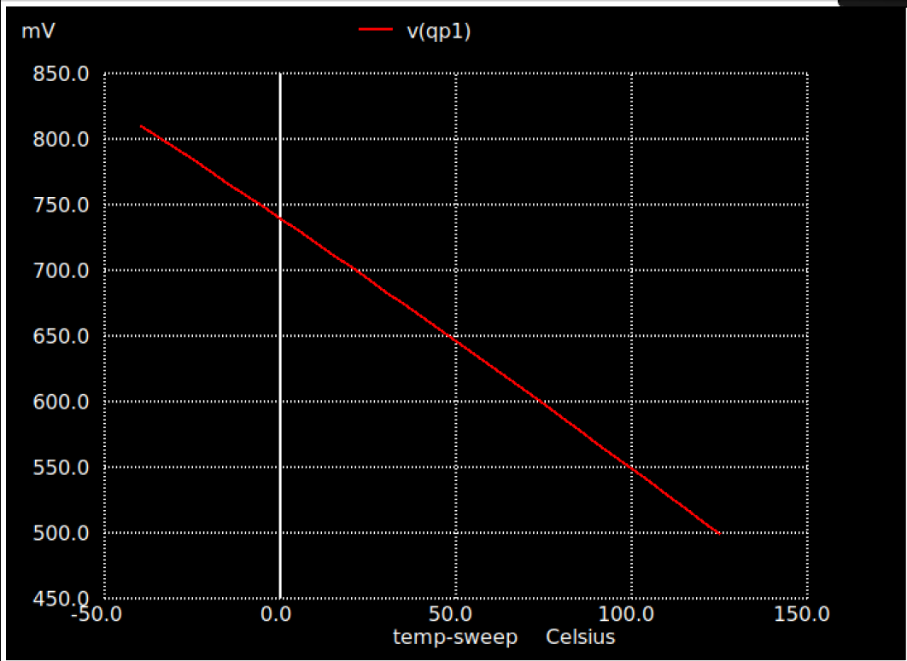
</p>

As we can see the slope is increasing in case of multiple BJTs.

**CTAT Voltage generation with different current source values** [netlist](prelayout/ctat_voltage_gen_var_current.sp)

In this simulation we will check the CTAT voltage dependancy on current.
<p align="center">
  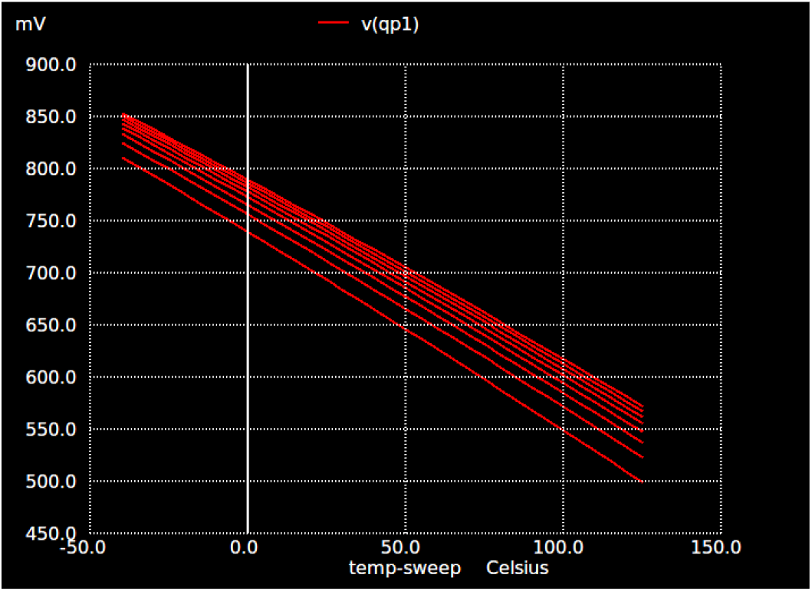
</p>

We can find that the voltage is decreasing with decrease in current value.

#### 3.4.2 PTAT Simulation

**PTAT Voltage generation with ideal current source** [netlist](/prelayout/ptat_voltage_gen_ideal_current_source.sp)

In this simulation we will take one ideal current source and will connect it to 5K Ohm resistance and 8 parallel BJTs. From this we will find the voltgae difference between the two terminals of the resistnce, which will give us a slightly PTAT voltage.
<p align="center">
  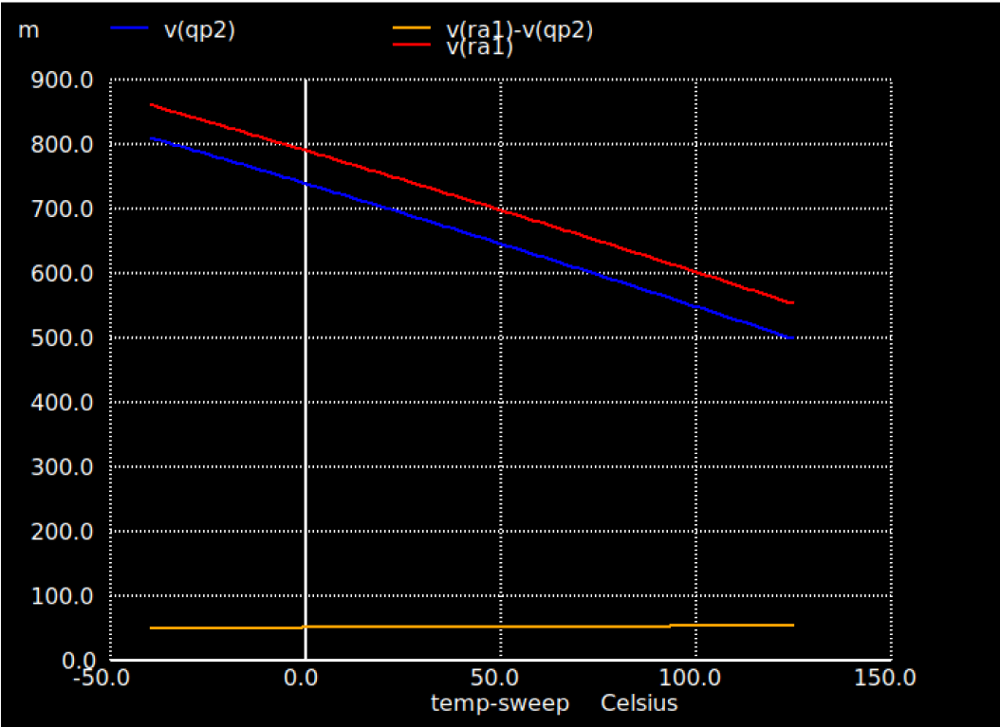
</p>

We can find that the voltage V(ra1)-V(qp2) is increasing with temp. which is the desired PTAT voltage.

**PTAT Voltage generation with VCVS** [netist](/prelayout/ptat_voltage_gen.sp)

In this simulation we will check the amplified PTAT voltage using one VCVS.
<p align="center">
  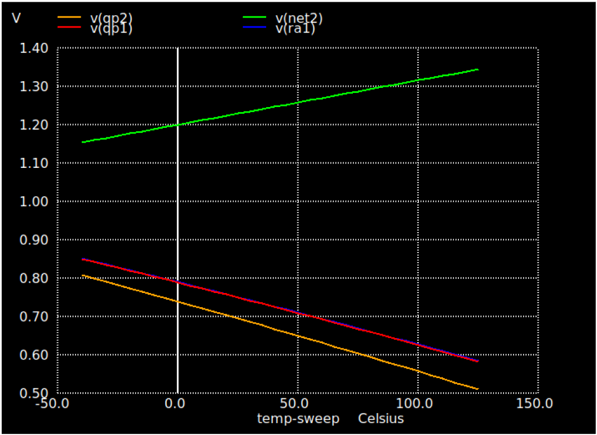
</p>


#### 3.4.3 Resistance tempco.

We know that resistor also behaves as PTAT, i.e the voltage across the resistor also increases with increase in the temp. In our BGR the PTAT voltage we are getting is not only by the virtue of Vt(Thermal voltgae) but with the additional PTAT voltage of the resistance.

In this simulation we will check the tempco. of resistor using ideal current source of 10uA. [netlist](/prelayout/res_tempco.sp)
<p align="center">
  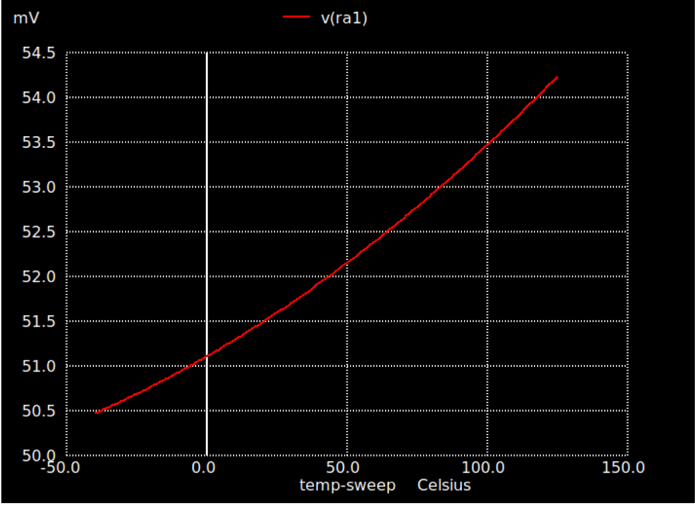
</p>

From the above curve we can find that the Voltage across the resistnace is increasing with increase in temp., i.e. the PTAT nature.

Now to find the temco. we have to find the change in resistance w.r.t temp. The tempco. can be found from the slope of the following curve.
<p align="center">
  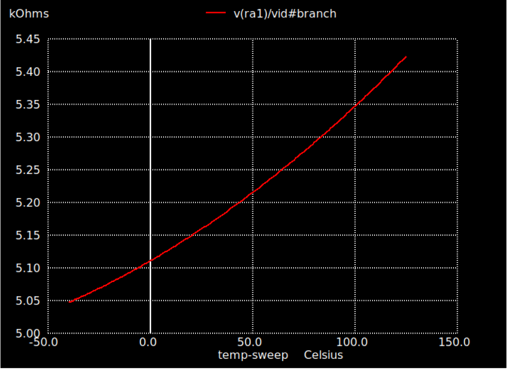
</p>

Also we can find the PTAT voltages across the resistance for different current values from the following curve. [netlist](prelayout/res_tempco_var_current.sp)
<p align="center">
  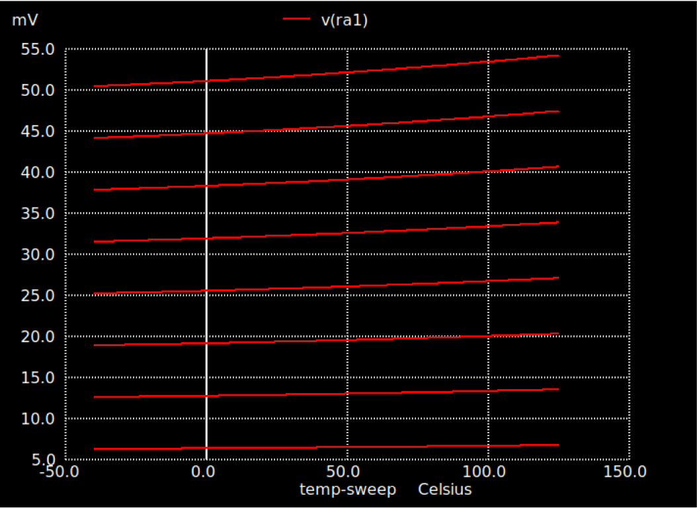
</p>

#### 3.4.4 BGR using Ideal OpAmp

Now after simulating all our components, let's quick check our BGR behaviour using one VCVS as an ideal OpAmp. [netlist](/prelayout/bgr_using_ideal_opamp.sp)

In this simulation we should get the reference voltgae as an umbrella shaped curve and it should be ~1.2V.
<p align="center">
  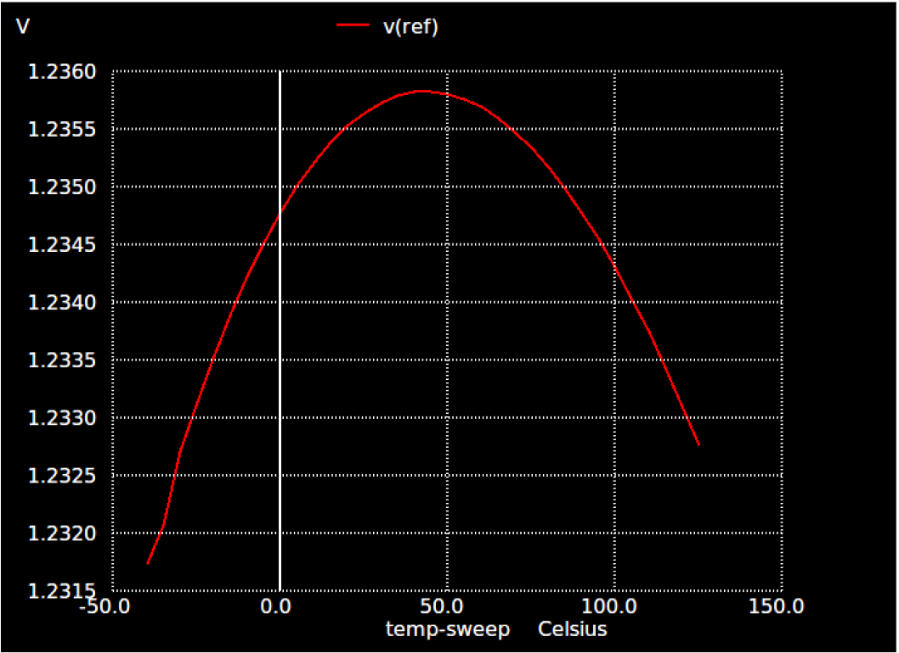
</p>

#### 3.4.5 BGR with SBCM

Now we will replace the ideal Op-Amp with self-biased current mirror which is our proposed design. We expect same type of output as in case of ideal OpAmp based BGR. We will also check for different corners, and will see how our circuit is performing in different corners.

- Behaviour in TT corner [netlsit](/prelayout/bgr_lvt_rpolyh_3p40.sp)
<p align="center">
  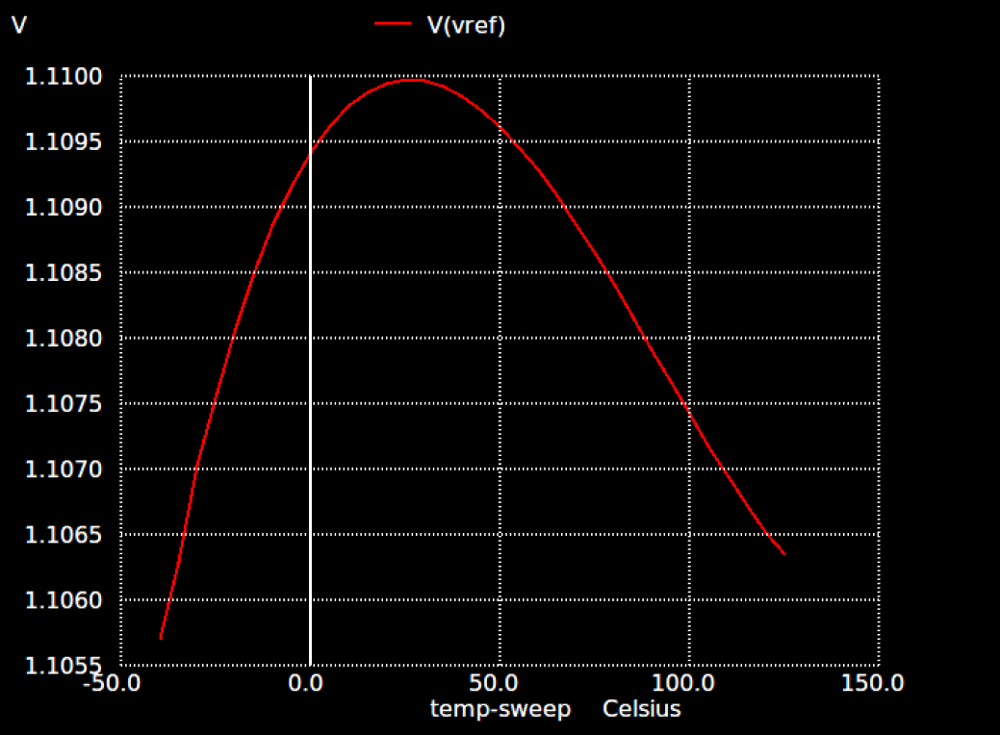
</p>

Tempco. Of Vref = ~21.7 PPM

- Behaviour in FF corner [netlist](/prelayout/bgr_lvt_rpolyh_3p40_ff.sp)
<p align="center">
  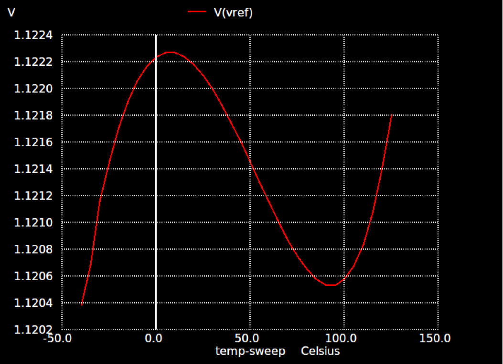
</p>

Tempco. Of Vref = ~10 PPM

- Behaviour in SS corner [netlist](/prelayout/bgr_lvt_rpolyh_3p40_ss.sp)
<p align="center">
  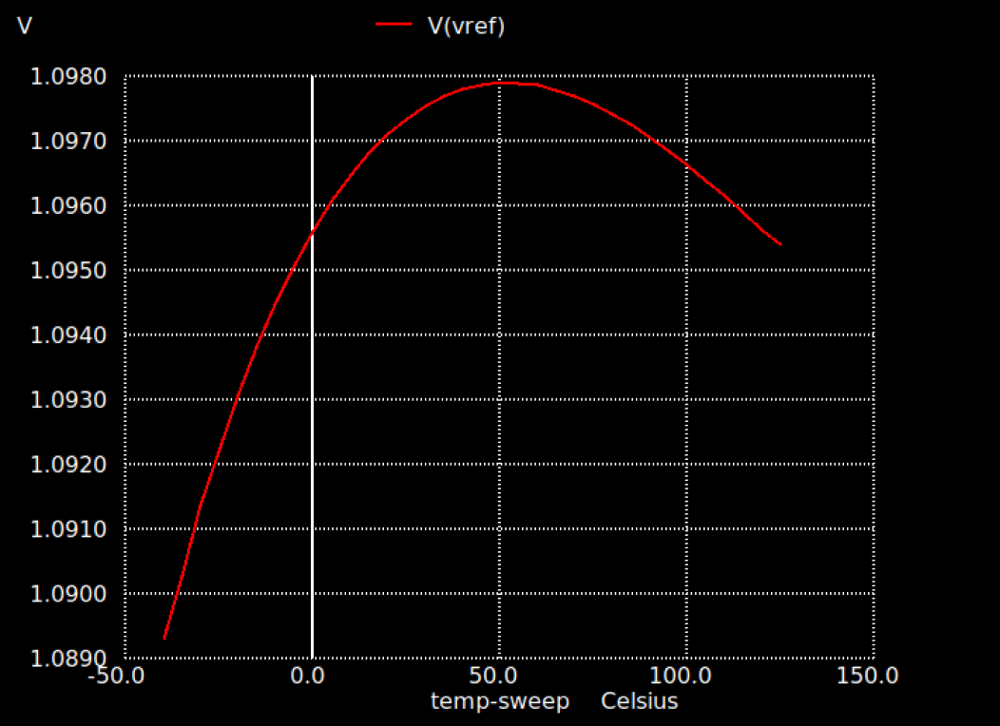
</p>

Tempco. Of Vref = ~45 PPM

## 4. Layout Design

Now after getting our final netlist, we have to design the layout for our BGR. Layout is drawning the masks used in fabrication. We are going to use the Magic VLSI tool for our layout design.

### 4.1 Getting started with Magic

Magic is an open source VLSI layout editor tool. To launch magic open terminal and write the following command.
```
$ magic -T /home/<path for sky130A.tech>/sky130A.tech 
```

Now it will open up two windows, those are `tkcon.tcl` and `toplevel`. Now let's discuss some basic magic tool operations.
```
g : grid on/off
z : zoom in
Shift + z : zoom out

Draw a box : 
  1. Left click + Right click of the mouse : pointer will be at a grid point
  2. Right click : a blank box will be created from the pointed point to the point where right click occured
 
Fill a box with a layer:
  1. Draw a box
  2. Select a layer from the tool manager
  3. Middle click the mouse button
  
  or 
  
  1. Draw a box
  2. Write "paint <layer name>" in the tkcon.tcl window


Delete a layer:
  1. Draw a box where you want to delete a layer
  2. Write "erase <layer name>" in the tkcon.tcl window
 
Delete an area:
  1. Draw a box where you want to delete an area
  2. Press 'a'
  3. Press 'd'

u : undo
r : rotate
m : move
c : copy
```
Now device wise we have the following devices in our circuit.
- PFETS
- NFETS
- Resistor Bank
- BJTs

Now in order to design faster we should follow the hierarchical design manner. i.e we will design one cell then we will instance that to another level and do placement and routing.

In our design we have 3 hierarchies. Those are 

1. Hierarchy-1 (Basic Cells) : NFET, PFET, BJT, Resistor
2. Hierarchy-2 (Blocks of similar cells): NFETS, PFETS, PNP10, RESBANK, STARTERNFET
3. Hierarchy-3 (Top Level): TOP

Now let's start with all leaf cell designs.
### 4.2 Basic Cell Design

#### 4.2.1 Design of NFET
In our circuit we are using LVT type NFETs. So we have to draw all the valid layers for the lvt nfet as per our desired sizes.

In our design we have used two different size nfets:

1. W=5 L=1 [mag file](/layout/nfet.mag)

<p align="center">
  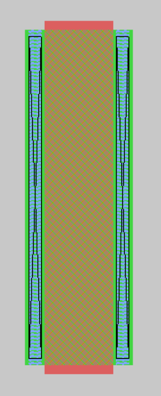
</p>

2. W=1 L=7 [mag file](/layout/nfet1.mag)

<p align="center">
  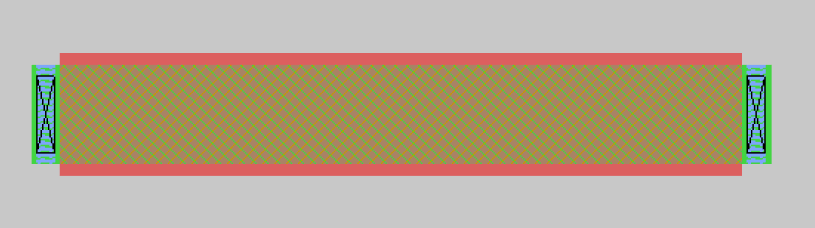
</p>

#### 4.2.2 Design of PFET
In our circuit we are using LVT type PFETs. So we have to draw our PFET using all valid layers for lvt pfet. In our design we have one size pfet i.e W=5 L=2 [mag file](/layout/pfet.mag)

<p align="center">
  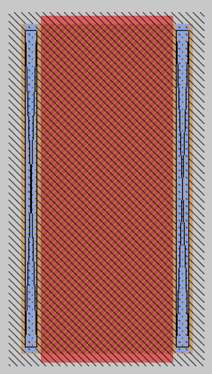
</p>

#### 4.2.3 Design of Resistor
In our desing we are using poly resistors of W=1.41 and L=7.8. So we have to create the magic file choosing the appropriate layers for the Resistor. [mag file](/layout/res1p41.mag)

<p align="center">
  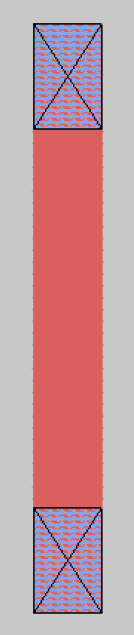
</p>

#### 4.2.4 Dessing of PNP (BJT)
In our design we are using PNP having emitter 3.41 * 3.41 uM.So we can use the valid layers to design our PNP. [mag file](/layout/pnpt1.mag)

<p align="center">
  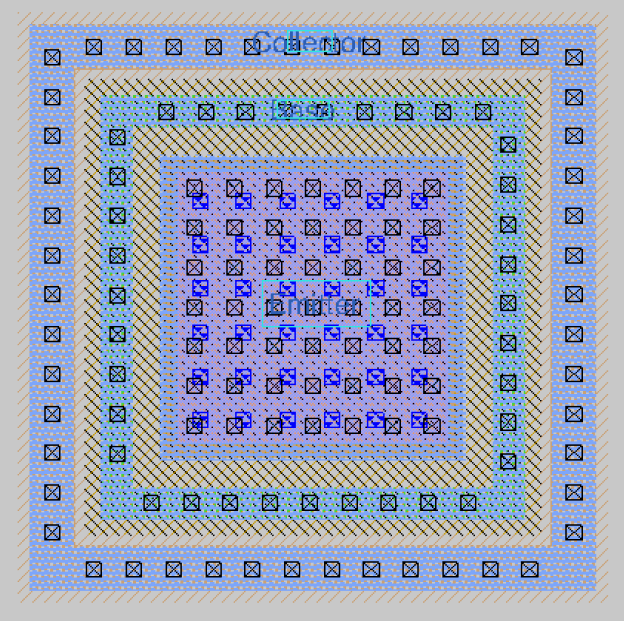
</p>

### 4.3 Blocks Design

#### 4.3.1 Design of NFETs
We have created a layout by putting all the nfets in one region. We have placed the nfets in such a way that it follows common centroid matching. Also used some dummies to avoid Diffusion break and for better matching and noise protection. Also added one guard ring for enhance performance. [mag file](/layout/nfets.mag)

<p align="center">
  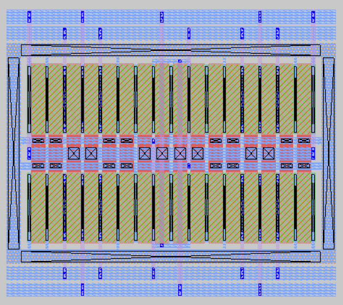
</p>

#### 4.3.2 Design of PFETs
We have created a PFETs block by putting all the pfets together, with matching arrangement, also added the guardring. [mag file](/layout/pfets.mag)

<p align="center">
  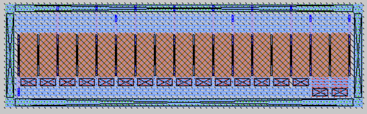
</p>

#### 4.3.3 Design of RESBANK
We have cretaed the layout of the RESBANK by putting all resistors together, with proper matching arrangemment and soe extra dummies and a guardring. [mag file](/layout/resbank.mag)
<p align="center">
  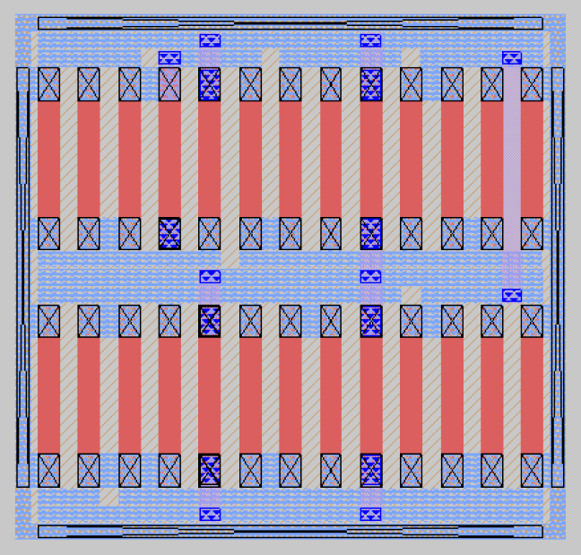
</p>

#### 4.3.4 Design of PNP10
We have created the layout by putting all the PNPs together, with appropriate matching, and used dummies to enhance noise performance. [mag file](/layout/pnp10.mag)
<p align="center">
  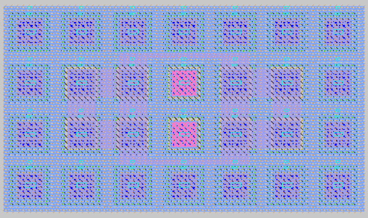
</p>

#### 4.3.5 Design of STARTERNFET
We placed the the two w=1, l=7 NFETs together with a guardring to desingn the STATRTERNFET. [mag file](/layout/starternfet.mag)
<p align="center">
  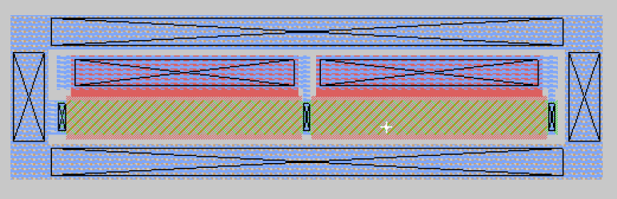
</p>

## 4.4 Top level design
To obtain the top level design, we have placed all the blocks together, routed it. [mag file](/layout/top.mag)
<p align="center">
  
</p>


## Author

Designed by [Subham Rath](https://in.linkedin.com/in/srath01) under the guidance of Prof. [Santunu Sarangi](https://in.linkedin.com/in/santunu-sarangi-b731305b) and Prof. [Saroj Rout](https://www.linkedin.com/in/sroutk/) in collaboration with [VSD](https://www.vlsisystemdesign.com/)


[Magic]:                http://opencircuitdesign.com/magic/
[Ngspice]:              http://ngspice.sourceforge.net
[Netgen]:               http://opencircuitdesign.com/netgen/
[NGSpiceMan]:           http://ngspice.sourceforge.net/docs/ngspice-html-manual/manual.xhtml
